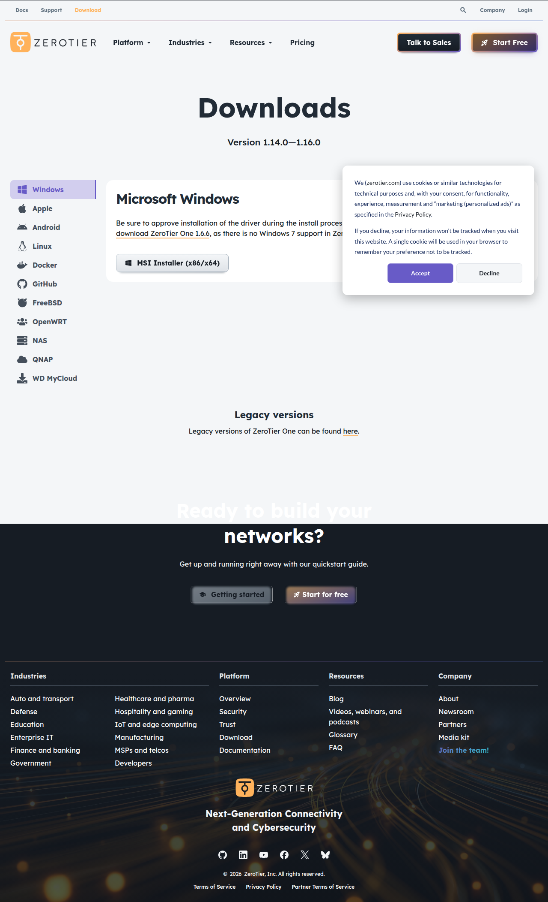

# Visited: https://www.zerotier.com/download/
**Time:** Thu May  7 16:45:11 UTC 2026

## Screenshot

## Raw HTML
[page.html](./page.html)

## Downloaded Media (3 files)
## Downloaded Media Files

## Other Links
- [#content](#content)
- [#elementor-action%3Aaction%3Doff_canvas%3Aclose%26settings%3DeyJpZCI6ImQ4ODk1OWYiLCJkaXNwbGF5TW9kZSI6ImNsb3NlIn0%3D](#elementor-action%3Aaction%3Doff_canvas%3Aclose%26settings%3DeyJpZCI6ImQ4ODk1OWYiLCJkaXNwbGF5TW9kZSI6ImNsb3NlIn0%3D)
- [#elementor-action%3Aaction%3Doff_canvas%3Aopen%26settings%3DeyJpZCI6IjBiMGU1NjkiLCJkaXNwbGF5TW9kZSI6Im9wZW4ifQ%3D%3D](#elementor-action%3Aaction%3Doff_canvas%3Aopen%26settings%3DeyJpZCI6IjBiMGU1NjkiLCJkaXNwbGF5TW9kZSI6Im9wZW4ifQ%3D%3D)
- [#elementor-action%3Aaction%3Doff_canvas%3Aopen%26settings%3DeyJpZCI6ImJkYmE5ODUiLCJkaXNwbGF5TW9kZSI6Im9wZW4ifQ%3D%3D](#elementor-action%3Aaction%3Doff_canvas%3Aopen%26settings%3DeyJpZCI6ImJkYmE5ODUiLCJkaXNwbGF5TW9kZSI6Im9wZW4ifQ%3D%3D)
- [#elementor-action%3Aaction%3Doff_canvas%3Aopen%26settings%3DeyJpZCI6ImQ4ODk1OWYiLCJkaXNwbGF5TW9kZSI6Im9wZW4ifQ%3D%3D](#elementor-action%3Aaction%3Doff_canvas%3Aopen%26settings%3DeyJpZCI6ImQ4ODk1OWYiLCJkaXNwbGF5TW9kZSI6Im9wZW4ifQ%3D%3D)
- [#elementor-action%3Aaction%3Dpopup%3Aopen%26settings%3DeyJpZCI6IjIyNTE0IiwidG9nZ2xlIjpmYWxzZX0%3D](#elementor-action%3Aaction%3Dpopup%3Aopen%26settings%3DeyJpZCI6IjIyNTE0IiwidG9nZ2xlIjpmYWxzZX0%3D)
- [/platform](/platform)
- [/platform#architecture](/platform#architecture)
- [/platform#feature](/platform#feature)
- [/platform#features](/platform#features)
- [https://accounts.zerotier.com/realms/zerotier/protocol/openid-connect/registrations?client_id=central-v2&#038;scope=openid%20profile&#038;redirect_uri=https%3A%2F%2Fcentral.zerotier.com%2F&#038;response_type=code](https://accounts.zerotier.com/realms/zerotier/protocol/openid-connect/registrations?client_id=central-v2&#038;scope=openid%20profile&#038;redirect_uri=https%3A%2F%2Fcentral.zerotier.com%2F&#038;response_type=code)
- [https://apps.apple.com/us/app/zerotier-one/id1084101492](https://apps.apple.com/us/app/zerotier-one/id1084101492)
- [https://bsky.app/profile/zerotier.bsky.social/](https://bsky.app/profile/zerotier.bsky.social/)
- [https://cdnjs.cloudflare.com/ajax/libs/prism/1.23.0/components/prism-core.min.js?ver=1.23.0](https://cdnjs.cloudflare.com/ajax/libs/prism/1.23.0/components/prism-core.min.js?ver=1.23.0)
- [https://cdnjs.cloudflare.com/ajax/libs/prism/1.23.0/plugins/autoloader/prism-autoloader.min.js?ver=1.23.0](https://cdnjs.cloudflare.com/ajax/libs/prism/1.23.0/plugins/autoloader/prism-autoloader.min.js?ver=1.23.0)
- [https://cdnjs.cloudflare.com/ajax/libs/prism/1.23.0/plugins/copy-to-clipboard/prism-copy-to-clipboard.min.js?ver=1.23.0](https://cdnjs.cloudflare.com/ajax/libs/prism/1.23.0/plugins/copy-to-clipboard/prism-copy-to-clipboard.min.js?ver=1.23.0)
- [https://cdnjs.cloudflare.com/ajax/libs/prism/1.23.0/plugins/line-numbers/prism-line-numbers.min.js?ver=1.23.0](https://cdnjs.cloudflare.com/ajax/libs/prism/1.23.0/plugins/line-numbers/prism-line-numbers.min.js?ver=1.23.0)
- [https://cdnjs.cloudflare.com/ajax/libs/prism/1.23.0/plugins/normalize-whitespace/prism-normalize-whitespace.min.js?ver=1.23.0](https://cdnjs.cloudflare.com/ajax/libs/prism/1.23.0/plugins/normalize-whitespace/prism-normalize-whitespace.min.js?ver=1.23.0)
- [https://cdnjs.cloudflare.com/ajax/libs/prism/1.23.0/plugins/toolbar/prism-toolbar.min.js?ver=1.23.0](https://cdnjs.cloudflare.com/ajax/libs/prism/1.23.0/plugins/toolbar/prism-toolbar.min.js?ver=1.23.0)
- [https://central.zerotier.com](https://central.zerotier.com)
- [https://docs.zerotier.com](https://docs.zerotier.com)
- [https://docs.zerotier.com/](https://docs.zerotier.com/)
- [https://docs.zerotier.com/api](https://docs.zerotier.com/api)
- [https://docs.zerotier.com/devices/synology](https://docs.zerotier.com/devices/synology)
- [https://docs.zerotier.com/faq/](https://docs.zerotier.com/faq/)
- [https://docs.zerotier.com/quickstart/](https://docs.zerotier.com/quickstart/)
- [https://docs.zerotier.com/security/](https://docs.zerotier.com/security/)
- [https://docs.zerotier.com/support](https://docs.zerotier.com/support)
- [https://download.zerotier.com/RELEASES/](https://download.zerotier.com/RELEASES/)
- [https://download.zerotier.com/RELEASES/1.6.6/dist/ZeroTier%20One.msi](https://download.zerotier.com/RELEASES/1.6.6/dist/ZeroTier%20One.msi)
- [https://download.zerotier.com/dist/ZeroTier%20One.msi](https://download.zerotier.com/dist/ZeroTier%20One.msi)
- [https://download.zerotier.com/dist/ZeroTier%20One.pkg](https://download.zerotier.com/dist/ZeroTier%20One.pkg)
- [https://download.zerotier.com/dist/qnap/](https://download.zerotier.com/dist/qnap/)
- [https://download.zerotier.com/dist/wd/](https://download.zerotier.com/dist/wd/)
- [https://facebook.com/zerotier/](https://facebook.com/zerotier/)
- [https://github.com/mwarning/zerotier-openwrt](https://github.com/mwarning/zerotier-openwrt)
- [https://github.com/zerotier/](https://github.com/zerotier/)
- [https://github.com/zerotier/ZeroTierNAS](https://github.com/zerotier/ZeroTierNAS)
- [https://github.com/zerotier/ZeroTierOne](https://github.com/zerotier/ZeroTierOne)
- [https://github.com/zerotier/ZeroTierOne/blob/master/ext/installfiles/linux/zerotier-containerized/Dockerfile](https://github.com/zerotier/ZeroTierOne/blob/master/ext/installfiles/linux/zerotier-containerized/Dockerfile)
- [https://github.com/zerotier/libzt](https://github.com/zerotier/libzt)
- [https://gmpg.org/xfn/11](https://gmpg.org/xfn/11)
- [https://jobs.lever.co/zerotier/](https://jobs.lever.co/zerotier/)
- [https://js.hs-scripts.com/46233949.js?integration=WordPress&amp;ver=11.3.45](https://js.hs-scripts.com/46233949.js?integration=WordPress&amp;ver=11.3.45)
- [https://my.zerotier.com/login](https://my.zerotier.com/login)
- [https://play.google.com/store/apps/details?id=com.zerotier.one&#038;pcampaignid=web_share](https://play.google.com/store/apps/details?id=com.zerotier.one&#038;pcampaignid=web_share)
- [https://savannah.nongnu.org/projects/lwip/](https://savannah.nongnu.org/projects/lwip/)
- [https://trust.zerotier.com](https://trust.zerotier.com)
- [https://www.freshports.org/net/zerotier/](https://www.freshports.org/net/zerotier/)
- [https://www.googletagmanager.com/gtag/js?id=GT-NFPL9MRT](https://www.googletagmanager.com/gtag/js?id=GT-NFPL9MRT)

## Stats
- Links: 111
- Media: 3
